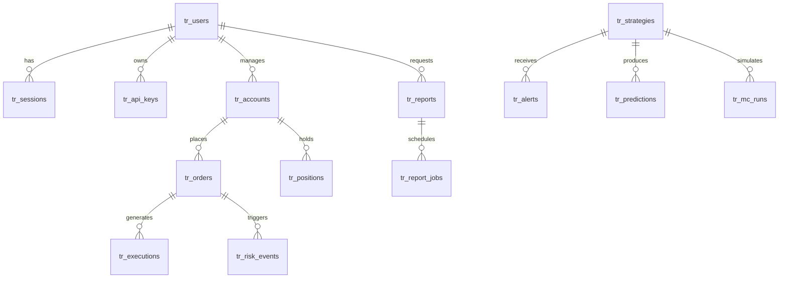

# Entity Relationship Overview

```mermaid
erDiagram
    tr_users ||--o{ tr_sessions : has
    tr_users ||--o{ tr_api_keys : owns
    tr_users ||--o{ tr_accounts : manages
    tr_accounts ||--o{ tr_orders : places
    tr_accounts ||--o{ tr_positions : holds
    tr_orders ||--o{ tr_executions : generates
    tr_strategies ||--o{ tr_alerts : receives
    tr_strategies ||--o{ tr_predictions : produces
    tr_strategies ||--o{ tr_mc_runs : simulates
    tr_orders ||--o{ tr_risk_events : triggers
    tr_users ||--o{ tr_reports : requests
    tr_reports ||--o{ tr_report_jobs : schedules
```
