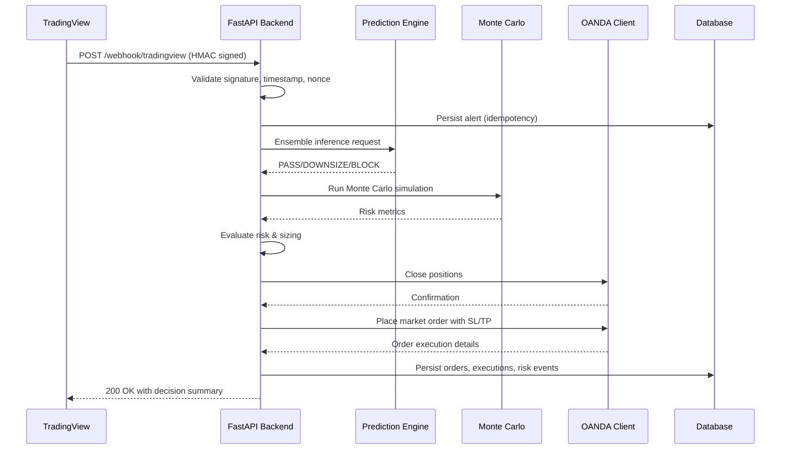

# TradingView Alert Processing

```mermaid
sequenceDiagram
    participant TV as TradingView
    participant API as FastAPI Backend
    participant Pred as Prediction Engine
    participant MC as Monte Carlo
    participant OANDA as OANDA Client
    participant DB as Database

    TV->>API: POST /webhook/tradingview (HMAC signed)
    API->>API: Validate signature, timestamp, nonce
    API->>DB: Persist alert (idempotency)
    API->>Pred: Ensemble inference request
    Pred-->>API: PASS/DOWNSIZE/BLOCK
    API->>MC: Run Monte Carlo simulation
    MC-->>API: Risk metrics
    API->>API: Evaluate risk & sizing
    API->>OANDA: Close positions
    OANDA-->>API: Confirmation
    API->>OANDA: Place market order with SL/TP
    OANDA-->>API: Order execution details
    API->>DB: Persist orders, executions, risk events
    API-->>TV: 200 OK with decision summary
```
